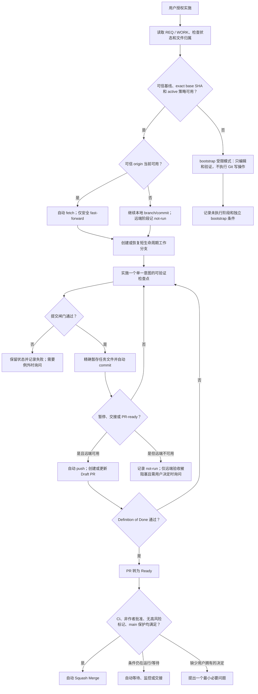

# 软件仓库 Git 工作流

本文件是 Easy Markdown **软件仓库**的 Git 协作唯一真源。它不定义产品内知识库的 Git
功能。目标是在不牺牲文件安全、评审和可恢复性的前提下，让 Agent 自动处理常规 Git
动作，只把真正需要人作决定的例外交还用户。

## 1. 核心模型

- 使用 Trunk-Based Development。
- `main` 是唯一长期主干并受保护；不得直接推送常规工作。
- 每个 WORK 使用一个短生命周期分支或独立 worktree，通过 PR 合入。
- 工作分支保留细粒度恢复提交；PR 默认 Squash Merge，主干只留下一个聚焦提交。
- 一次明确的“做、修、实现、继续实施”授权，同时授权本 WORK 的安全常规 Git 生命周期。
- “分析、诊断、评审、只给方案、先别改”不授权任何 Git 写操作。
- 新分支必须从已验证的主干引用与准确 base SHA 创建；恢复分支必须验证 ancestry 和提交归属。

详细授权只覆盖当前任务拥有的文件、当前任务分支和已配置的可信 `origin`。它不覆盖发布、
部署、标签、远端变更、共享历史改写或其他任务的文件。可信远端、refspec、保护与 merge
能力以机器可读的 [Git 策略](git-policy.json) 为准，不能只凭远端名称推断。

Git 权限从分支点 base SHA 上已经生效的规则开始计算。每次 push、Ready 或 merge 前还要
fetch 当前受保护主干 tip，并读取该 tip 与候选 HEAD 的规则；采用
**分支点 base、当前 protected tip 与候选规则三者的交集，取最严格者**。任务分支不能
为自己增加权限，旧分支也不能绕过主干后来收紧的规则。命中 `governance_paths` 的规则、CI、CODEOWNERS 和
Harness 校验变化自动视为高风险，需要当前有效规则指定的维护者/CODEOWNER 独立批准，
不得自动 merge。

## 2. 自动生命周期



## 3. 分支与同步

### 分支命名

- Agent 标准 WORK：`codex/WORK-YYYY-NNN-<short-slug>`。
- 人类成员：`<handle>/WORK-YYYY-NNN-<short-slug>`。
- 轻微变更进入自动 commit/PR 生命周期时，由 Agent 后台建立 `requirement: none` 的轻量
  WORK，并使用标准 WORK 分支名。只有用户明确要求本地、不提交且同会话完成的轻微编辑
  可以省略 WORK；它不创建分支、commit、PR 或 Ready 候选。
- 紧急变更仍应使用可追踪短分支；不得借“紧急”直接绕过主干保护。

分支名使用小写 slug，只表达一个工作意图。一个分支不得同时承载多个无关 WORK。

### 开始与恢复

1. 检查当前分支、工作区、暂存区、未跟踪文件、上游和远端。
2. 有匹配 active WORK 时恢复其分支；不存在时才创建新分支。
3. 从 [Git 策略](git-policy.json) 读取受保护分支和负责人批准的 canonical repository、fetch
   URL、push URL、URL rewrite 与允许 refspec。在任何网络访问前，枚举所有配置来源和
   include 中的 `remote.<name>.url`/`pushurl`、`url.*.insteadOf`/`pushInsteadOf`，用 Git 的
   解析语义得到 `git remote get-url --all` 和 `--push --all` 的全部实际端点。每个 raw URL
   必须本身获批，或只经过策略中精确获批的 rewrite；每个解析后端点、scheme 和目标仓库
   都必须精确匹配策略。未知 remote helper、`ext`/`file` 类端点、未批准 rewrite 或任一
   多值 URL 不匹配时，在 fetch/push 前阻断。
4. 端点预检通过后才自动 fetch，并禁用非必要 submodule recursion；随后解析并记录准确
   base ref、分支点 base SHA 和当前 protected-tip SHA。新分支必须直接从该 base SHA 创建，
   不能从当前任意 HEAD 派生。
5. 恢复已有分支时验证 merge-base、上游、base ancestry 和该 WORK 的提交集合；混入另一
   WORK 或来源不明提交时停止。
6. 只有目标引用可以无冲突 fast-forward，且工作区不会被覆盖时才自动更新。
7. 当前工作树包含受保护改动但可信 base 存在时，优先从准确 base SHA 创建隔离 worktree；
   不为了复用当前目录而询问或触碰脏文件。
8. `main` 正常前进本身不是用户决定：fetch 后重新计算 merge-base 和 PR mergeability；
   分支仍可合并时继续等待平台以最新主干原子合入，不要求用户选择同步方式。
9. 工作分支相对自身上游出现非快进、实际合并冲突、来源不明提交，或无法安全隔离的脏
   主干时，不自动 merge、rebase、reset 或 stash；先保存证据并进入必要询问。

不得为了“获得干净状态”清理、回滚、隐藏或格式化现有文件。未跟踪文件也属于受保护数据。

## 4. 自动 commit

Agent 在以下条件全部满足时自动创建检查点提交，不询问用户：

1. 当前任务具有实施授权，且不受“不要提交”之类的显式限制。
2. 当前分支是该 WORK 的聚焦分支，不是受保护主干。
3. 变更构成一个单一意图的可恢复检查点。
4. WORK、REQ 和相关基线已同步到当前事实。
5. 已审查完整状态和差异，路径及其任务开始状态均属于当前任务。
6. 未发现凭据、秘密、个人信息、异常大文件、意外二进制、生成物或调试文件。
7. 与该检查点风险相称的格式、静态、测试、安全和 Harness 检查通过。

`git-policy.json` 的文件大小阈值和二进制 allowlist 定义“异常文件”。超过阈值的新增/变更
文件，或不在 allowlist 中的新二进制，不能自动暂存；不得由不同 Agent 临时采用不同标准。

WORK 必须记录 `base_ref`、`base_sha`、`owned_paths`，以及任务开始时每个目标路径是 clean、
modified、staged、untracked 还是 absent。只有开始时 clean 且由本 WORK 修改的路径，或本
WORK 从 absent 新建的路径，才可以按整路径自动暂存。

任务开始前已经 modified、staged 或 untracked 的文件默认整文件受保护，即使 Agent 后来
也修改了它。不得用路径级 `git add` 把用户 hunks 一并提交。优先在准确 base SHA 的隔离
worktree 重做 Agent 变更；只有能从任务开始快照证明并安全构造纯 Agent patch 时才暂存其
hunks。变更依赖用户 hunks、无法可靠分离或需要纳入整文件时，提出一个文件归属决定。

暂存必须显式列出已证明归属的路径或纯 Agent patch。不得用 `git add -A`、`git add .` 或
通配式批量暂存来绕过归属判断。已有暂存内容不属于当前任务时停止，不修改用户的暂存区。

### 提交信息

标题采用简洁的 Conventional Commit 风格：

```text
<type>(<scope>): <imperative summary>

Work: WORK-YYYY-NNN
Req: REQ-YYYY-NNN
```

常用 `type` 为 `feat`、`fix`、`docs`、`test`、`refactor`、`chore`。轻量 WORK 的
`requirement` 为 `none` 时只省略 `Req` trailer，仍保留 `Work`。不得把无关变更塞入同一
提交；已推送提交不自动 amend 或 rebase，需要修正时创建后续提交，最终由 Squash Merge
整理主干历史。

检查失败时不把失败写成通过，也不自动创建“看似完成”的提交。若远端保存未验证工作是
继续协作的必要条件，先说明失败和风险，再只询问是否允许建立明确标记的 WIP 检查点。

## 5. 自动 push

以下任一交接点到达时，Agent 自动 push 最新合格提交：

- 当前任务需要暂停或跨会话交接。
- 一个计划中的工作切片完成并需要团队可见。
- 分支已达到 Draft PR 更新点或 PR-ready。
- 用户明确要求远端协作结果。

push 前先重复上述无网络端点预检；通过后才重新 fetch。所有 raw/解析后 fetch URL、push
URL、获批 rewrite 和 scheme 都必须与 [Git 策略](git-policy.json) 精确匹配；canonical
repository、目标 refspec 和当前任务分支一致；待推送提交全部属于该 WORK；没有新秘密/
异常文件；相关检查结果仍有效。首次推送使用显式的本地与远端 ref；后续只做普通
fast-forward push。远端名为 `origin` 本身不构成信任。

push 还必须比较分支点 base SHA、fetch 后当前 protected tip 和候选 HEAD 的策略，使用
三者最严格的结果。若 changed files 命中 `governance_paths`，必须先获得当前有效规则指定
的独立维护者/CODEOWNER 批准；若命中 `remote_execution_paths`，普通自动 push 被阻断，
直到独立安全/维护者批准。候选 workflow、local action、reusable include、脚本或构建入口
不能批准自己的首次远端执行。

无论 changed files 是否直接命中 CI 清单，所有未评审分支代码都视为不可信远端代码。
`active` 模式启用前必须由平台证据保证：分支/PR 触发器及 `pull_request_target` 等危险
等价触发器不会让候选代码获得生产秘密、发布凭据、可写或高权限 token；凭据不会持久化；
外部 action/workflow/include 使用不可变版本；本地 action/include 和 unchanged CI 间接
执行的代码也受同一无特权边界约束。任一事实无法验证时，不得启用远端自动 push。

首次 push 没有 upstream 是正常状态，验证显式 refspec 后自动建立，不询问。以下情况不
重试危险替代方案：非快进拒绝、远端分支来源不明、`origin`/凭据/身份缺失、目标远端改变
或服务端策略拒绝。记录准确错误；本地工作可继续时继续并交接，只有已接受验收标准明确
要求远端分支/PR，且缺失条件需要用户选择或授权时才询问。

永不自动使用 `--force`、`--force-with-lease`，也不通过删除远端分支或改写提交来让 push
“成功”。

## 6. Draft PR、Ready 与 merge

远端和托管平台集成可用时：

1. 首次 push 后自动创建 Draft PR；已有 PR 时更新，不重复创建。
2. PR 标题保持单一意图；正文包含 REQ/WORK、范围、非目标、验证证据、风险、回退和未运行项。
3. 后续交接点 push 后同步 PR 状态和验证结果。
4. PR-ready 检查全部满足后自动将 Draft 转为 Ready。PR-ready 要求实现、验收映射、相关
   测试、文档、完整差异和交接证据完成，WORK 已为 `done` 且归档；不要求 PR 已经 merge。
   `abandoned` 是独立终态，永不转 Ready 或 merge。
5. 同时满足下列条件时自动 Squash Merge：
   - 分支点 base、当前 protected tip 与候选 HEAD 的规则取最严格交集，所有闸门仍允许；
   - exact head SHA 已固定，changed-files、所有必需 CI/checks 与批准都对应这个 SHA；
   - 变更等级是 `trivial` 或 `standard`，至少一位非作者批准，且没有未解决的阻断评审；
   - 轻微/标准变更没有由路径、REQ、依赖、安全/数据扫描或评审产生的高风险标记；“没有
     人手工打标签”不能作为无风险证据；
   - `main` 的分支保护真实启用并阻止直接 push/失败检查合入；
   - 平台会在新 push 后撤销旧批准，并支持以 expected head SHA 原子比较后合并；
   - 合并基线未分叉，PR 仍可安全合并。

`significant` 和 `emergency` 始终属于高风险，不自动 merge。重大变更必须取得产品/技术
责任人的对应批准；安全、数据、迁移、依赖、治理或远端执行路径还需要指定专业视角批准，
随后由负责人明确决定是否合并。

任一条件无法验证时不得推断为满足。merge 前重新获取 HEAD、checks、changed-files、批准
和保护状态；expected head 已改变时重新走闸门。CI 运行中、等待评审或平台队列中时自动
等待、监控或交接，不询问用户。只有缺失条件需要用户作风险、权限、基础设施或冲突决定，
且它阻塞已接受的合并目标时，才提出一个最小必要问题。合并后的主干提交标题关联
WORK/REQ；发布状态仍由独立发布流程决定。

## 7. 动作与询问矩阵

| 场景 | 默认行为 | 是否询问 |
| --- | --- | --- |
| 清晰实施任务，分支/文件归属明确 | 必要时后台建轻量 WORK；自动建分支、检查点 commit | 否 |
| 暂停、交接、PR-ready，可信远端与检查可用 | 自动 push、创建/更新 Draft PR | 否 |
| 全部 merge 保护条件可验证 | 自动 Squash Merge | 否 |
| 用户说“不要提交/不要推送/不要开 PR” | 遵守更窄限制并写入 WORK | 否 |
| 诊断、评审、方案或只读请求 | 不执行 Git 写操作 | 否 |
| 没有可信初始 commit/base SHA | 只编辑、验证和记录；不 branch/commit/push/PR/merge | 是，仅独立 bootstrap 目标需要推进时 |
| 修改中混入非当前任务或归属不明文件/暂存内容 | 停止相关 Git 动作，列出路径 | 是，只问归属/处理决定 |
| 发现凭据、token、私钥或其他秘密 | 硬阻断 commit/push；移出候选变更，已暴露时进入轮换/事件流程 | 不提供“仍然纳入”选项 |
| 发现客户内容、个人信息或其他受控数据 | 阻止 push，保留最少必要证据 | 是，只问数据负责人授权/脱敏决定 |
| 超过策略阈值的大文件、非 allowlist 二进制或批量生成物 | 阻止自动暂存 | 是，只问清理、LFS/存储或明确纳入策略 |
| 命中治理/CI/CD/release/CODEOWNERS 等敏感路径 | 使用分支点 base、当前 protected tip 与候选策略的严格交集；阻止自我授权和普通自动 push/merge | 是，仅在需要独立维护者/安全决定时 |
| 检查失败但请求豁免、WIP 远端保存或合并 | 保留失败证据 | 是，只问所需例外 |
| 无可信 `origin`、Git 身份、凭据或托管权限 | 本地工作可继续则记录；远端验收必需才暂停 | 仅在成为验收阻塞时；首次 upstream 不询问 |
| 工作分支/上游非快进、真实冲突、脏主干无法隔离或远端来源变化 | 不自动 merge/rebase/reset/stash/force | 是，只问解决策略 |
| 主干正常前进但 PR 仍可合并 | 重新验证 exact HEAD/checks，继续等待或合并 | 否 |
| CI 正在运行或等待必需评审 | 等待、监控或交接，不把等待变成用户决定 | 否 |
| 分支保护/必需 CI/批准缺失或配置错误（不是运行中/等待中） | 不自动 merge | 仅在已接受集成目标需要用户作基础设施/权限决定时 |
| 强制推送、共享历史重写、安全闸门绕过 | 拒绝自动执行 | 即使询问也须单独高风险授权与规则允许 |
| 发布、部署、发布标签、修改远端或保护规则 | 不属于普通开发授权 | 是，必须明确点名 |

提问时一次只处理一个阻塞决定，并给出推荐答案。可以自动查到的远端、分支、检查和文件
事实不得反问用户。

## 8. 失败、恢复与交接

- Git 命令失败后保留完整退出状态和安全范围内的错误摘要，不把部分成功描述成成功。
- commit 成功但 push 失败时保留本地提交，记录提交 ID、失败原因和安全重试条件。
- push 成功但 PR 创建失败时记录分支和提交，不重复 push；恢复时先查是否已有 PR。
- PR 条件在等待期间变化时重新获取真实状态，不沿用旧聊天中的“已经通过”。
- 合并失败或状态不确定时先查询远端，禁止盲目重试。

WORK 交接至少记录：当前/上游分支、HEAD、未提交与未跟踪状态、最后成功 commit、push
状态、base ref/SHA、owned paths/初始状态、PR exact head、链接/状态、检查与评审状态、
风险等级、自动 merge 条件、失败与下一安全动作。凭据、正文和秘密不得写入 WORK 或日志。

Definition of Done 表示分支已经达到可交付、可评审并可归档的状态，不以 merge 已完成为
前提。WORK 可以在最终 PR 提交中变为 `done` 并归档；PR/托管平台是随后 Ready、auto-merge
和实际 merge 结果的真源。merge 结果不通过另一个“关闭 WORK”提交回写，避免形成循环。

`abandoned` 不表示 DoD，也不产生 Ready/merge 候选。放弃时先记录原因、保留结果、残余
风险和后续归属，归档后再次运行 Harness；若策略允许，只把终止证据作为 Draft/关闭交接
保存，不得把未完成分支转为 Ready、自动 merge 或宣称验收通过。

## 9. Bootstrap 与托管平台启用

没有可信初始提交、准确 base SHA 或激活的 [Git 策略](git-policy.json) 时，自动 Git 工作流
处于 **bootstrap 受限模式**：可以编辑和验证，但不得 branch、commit、push、创建 PR 或
merge。尤其不得通过普通任务创建不完整 root commit，或把全部/部分既有未跟踪文件自动
认定为基线。负责人需要用独立 bootstrap 需求确认初始纳入范围、默认分支、远端地址、
Git 身份、策略文件和托管平台权限。

`git-policy.json` 是远端信任与自动 merge 能力的机器真源：

- `bootstrap-limited` 要求 canonical repository 和所有远端 URL/check 列表为空，确保当前
  不会上传数据。
- 切换到 `active` 必须通过独立 accepted REQ，由负责人写入 canonical repository、所有
  允许 fetch/push URL、必需 checks 和平台保护能力，并验证 `untrusted_branch_ci` 的无生产
  秘密、只读 token、不持久化凭据、不可变外部 include 和禁止特权分支执行约束。
- Agent 每次 push/merge 都读取并核对当前策略，不依赖聊天记忆或仅凭远端名。
- Agent 在任何 fetch/push 前枚举所有 raw 与 Git 解析后的 fetch/push URL；URL rewrite
  只有精确列入 `approved_url_rewrites` 才可用，且所有最终 scheme/端点仍须获批。
- 修改 URL、ref prefix、敏感路径、文件阈值/二进制 allowlist、required checks、merge class
  或保护布尔值属于重大治理变化，不能作为普通任务的顺手调整。

启用远端自动化前应具备：

- 已审核的初始基线与 `main`。
- 由负责人批准并写入 Git 策略的 canonical repository、fetch/push URL、refspec 与最小
  权限凭据。
- 必需 CI/checks 与 `main` 分支保护。
- 所有未评审分支代码（包括 local action/include 和 unchanged CI 间接执行的代码）均无
  生产秘密、发布凭据、可写/高权限 token 或持久化凭据；危险等价触发器不能绕过此边界。
- 外部 action、workflow 和 include 固定到不可变版本。
- 至少一位可用的非作者评审者。
- 新 push 撤销旧批准，以及支持 expected-head 原子 merge 的托管平台能力。
- 支持查询 exact HEAD、changed-files、PR、检查、批准和合并状态的托管平台工具或连接器。

缺少上述能力不会阻止本地实现，但相应 push、PR 或 merge 必须记录为 `not-run`，不能虚构
完成。本仓库当前正处于这一受限模式；首次基线导入和远端配置不属于
[REQ-2026-003](../requirements/REQ-2026-003-建立低打扰自动化-git-工作流.md) 的实施范围。
