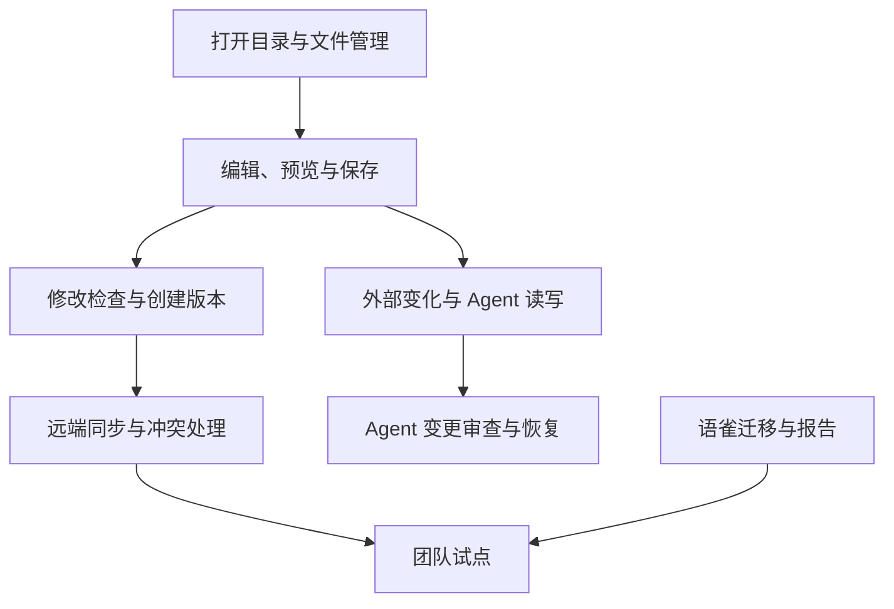

# Easy Markdown 用户故事与验收标准

| 字段 | 内容 |
| --- | --- |
| 文档状态 | Draft backlog |
| 版本 | 0.1 |
| 日期 | 2026-07-18 |

优先级说明：

- P0：进入内部 MVP。
- Pilot：不阻塞编辑器原型，但阻塞真实团队试点。
- P1：MVP 验证后排期。

## Epic A：本地知识库

### US-01 打开现有目录

**优先级：P0**

作为团队成员，我希望打开任意本地文件夹作为知识库，以便继续使用已有文档。

验收标准：

- 不移动、复制或转换原文件。
- 正确展示子目录中的 `.md` 和 `.txt`。
- `.git` 和应用内部目录不出现在文档树。
- 关闭应用后，文件仍可被普通文本编辑器读取。

### US-02 管理文档和目录

**优先级：P0**

作为文档作者，我希望创建、重命名、移动和删除文档，以便维护知识结构。

验收标准：

- 操作立即反映到文件系统。
- 不允许将文件移动到知识库根目录之外。
- Git 能识别对应的新增、移动、重命名和删除。
- 删除前确认，未跟踪文件也有可恢复路径。

### US-03 编辑和预览

**优先级：P0**

作为文档作者，我希望同时编辑和预览 Markdown，以便确认最终阅读效果。

验收标准：

- 支持源码、预览、分栏三种模式。
- 支持约定的 Markdown 基础语法。
- TXT 使用纯文本方式编辑。
- 预览不修改源文件。

### US-04 自动保存

**优先级：P0**

作为文档作者，我希望内容自动保存，以免意外丢失。

验收标准：

- 内容在合理时间内落盘。
- 保存失败时显示持续可见的错误状态。
- 关闭并重新打开应用后内容仍存在。
- 自动保存不自动创建 Git Commit。

### US-05 处理外部文件变化

**优先级：P0**

作为同时使用 Agent 和其他编辑器的用户，我希望应用能感知外部变化，以免看到过期内容。

验收标准：

- 能检测外部创建、修改、移动和删除。
- 当前没有未保存内容时自动刷新。
- 存在未保存内容时不静默覆盖。
- 用户可以比较本地编辑内容和外部内容。

### US-06 搜索知识

**优先级：P0**

作为知识消费者，我希望搜索文件名和正文，以便快速找到项目知识。

验收标准：

- 支持文件名和全文关键词搜索。
- 结果包含文件路径和命中片段。
- 点击结果可以打开文件。
- 索引损坏或删除后可以重建。

### US-07 阅读链接和图片

**优先级：P0**

作为知识消费者，我希望点击文档链接并查看本地图片，以便正常阅读迁移内容。

验收标准：

- 标准相对 Markdown 链接可以导航。
- 常见本地图片可以预览。
- 失效链接有明确状态。
- 越过知识库边界的资源不会被静默加载。

## Epic B：Git 版本和团队协作

### US-08 查看修改

**优先级：P0**

作为作者，我希望查看当前修改，以便确认哪些内容将被记录。

验收标准：

- 区分新增、修改、删除和重命名文件。
- 文本文件支持逐行差异。
- 可以选择单个文件查看。
- 可以恢复指定文件的未提交变化。

### US-09 创建版本

**优先级：P0**

作为作者，我希望创建一个带说明的版本，以便记录修改目的。

验收标准：

- 可以选择本次包含的文件。
- 必须提供版本说明。
- 没有变化时不能创建版本。
- 成功后可在历史中查看作者、时间、说明和差异。

### US-10 同步团队更新

**优先级：P0**

作为团队成员，我希望一键同步远端，以便获得同事更新并上传自己的版本。

验收标准：

- 使用用户已有 Git 配置和凭据。
- 获取远端变化后再推送。
- 失败时不丢失本地未提交内容。
- 不执行隐式强制推送。
- 断网时明确显示本地未同步状态。

### US-11 处理内容冲突

**优先级：P0**

作为团队成员，我希望同步冲突时得到清晰引导，以免覆盖同事内容。

验收标准：

- 展示冲突文件列表。
- 可以分别查看本地和远端内容。
- 可以选择一方或手动合并。
- 所有冲突解决前禁止标记同步成功。

### US-12 查看历史并恢复

**优先级：P0**

作为团队成员，我希望查看文档历史并恢复旧版本，以便追踪和纠错。

验收标准：

- 可以查看知识库和单文档历史。
- 显示作者、时间、说明和差异。
- 恢复产生新的变化记录。
- 不改写已经共享的历史。

### US-13 提交远端评审

**优先级：P1**

作为审阅者，我希望作者和 Agent 通过独立分支提交评审，以便保护正式知识。

验收标准：

- 可以创建和切换变更分支。
- 可以推送当前分支。
- 主分支不被直接覆盖。
- 可以跳转或复制现有 Git 平台的评审入口。

## Epic C：Agent 协作

### US-14 Agent 直接读取

**优先级：P0**

作为开发者，我希望 Agent 可以直接读取知识库文件，以便在分析需求和代码时引用文档。

验收标准：

- 不需要 Easy Markdown 私有 API。
- 应用关闭时文件仍可访问。
- 文件路径稳定且使用普通文本格式。
- 搜索缓存不是读取正文的必要条件。

### US-15 Agent 修改后自动刷新

**优先级：P0**

作为 Agent 操作者，我希望 Agent 修改文件后应用自动刷新，以便立即检查结果。

验收标准：

- 外部修改在合理时间内显示。
- 修改进入统一的变化列表。
- 当前存在未保存内容时不覆盖。
- 删除和移动也能被识别。

### US-16 审查 Agent 修改

**优先级：P0**

作为 Agent 操作者，我希望查看 Agent 造成的所有差异，以便决定是否接受。

验收标准：

- 展示 Agent 任务影响的全部文件。
- 可以逐文件检查增删行。
- 可以继续人工编辑。
- 用户确认前不自动推送正式分支。

### US-17 撤销 Agent 错误

**优先级：P0**

作为 Agent 操作者，我希望撤销 Agent 的错误修改，以便恢复正确知识。

验收标准：

- 未提交修改可按文件恢复。
- 已提交修改通过新版本回退。
- 批量撤销前展示影响范围。
- 回退过程不使用强制推送。

### US-18 限制 Agent 权限

**优先级：P1**

作为管理员，我希望限制 Agent 可访问的知识库和写入模式，以降低越权风险。

验收标准：

- 至少支持只读、允许修改、仅生成建议三种模式。
- 明确显示 Agent 获得授权的根目录。
- 防止路径穿越和通过符号链接越界。
- 模式切换和授权行为有本地记录。

## Epic D：迁移和治理

### US-19 导入语雀文档

**优先级：Pilot**

作为知识库管理员，我希望导入语雀导出的文档，以便低成本开始试点。

验收标准：

- 支持约定的 Markdown 或 ZIP 输入。
- 尽可能保留目录层级、正文和本地图片。
- 文件名冲突使用确定性规则。
- 原始导出文件不被修改。

### US-20 查看迁移报告

**优先级：Pilot**

作为知识库管理员，我希望知道哪些内容没有成功迁移，以便安排人工处理。

验收标准：

- 报告成功和失败文档。
- 报告重命名文件、远程图片、失效链接和不支持内容。
- 每条问题能定位回来源文档。
- 不允许静默丢弃无法转换的内容。

### US-21 使用文档模板

**优先级：P1**

作为团队成员，我希望使用需求、技术方案和测试计划模板，以便统一文档结构。

验收标准：

- 模板本身也是普通 Markdown。
- 团队可以新增和修改模板。
- 创建后不依赖模板文件才能阅读。
- Agent 可以直接读取模板。

### US-22 使用可选元数据

**优先级：P1**

作为知识治理者，我希望标记文档类型、负责人和状态，以便检索和自动化。

验收标准：

- 元数据保存在标准 YAML Front Matter。
- 没有元数据的普通 Markdown 仍能正常工作。
- 元数据错误不会破坏正文。
- 应用明确提示无法解析的字段。

### US-23 发现疑似敏感信息

**优先级：P1**

作为管理员，我希望在创建版本前发现疑似密钥和敏感内容，以免秘密进入 Git 历史。

验收标准：

- 命中时显示文件和位置。
- 默认阻止或强提醒创建版本。
- 允许有记录的例外处理。
- 扫描日志不复制敏感内容。

## 依赖关系

