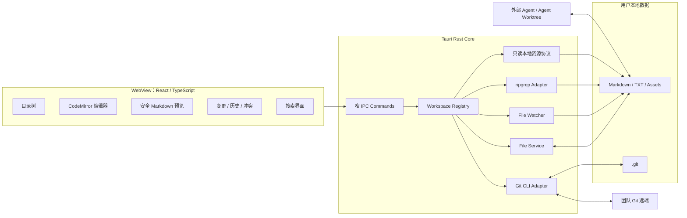
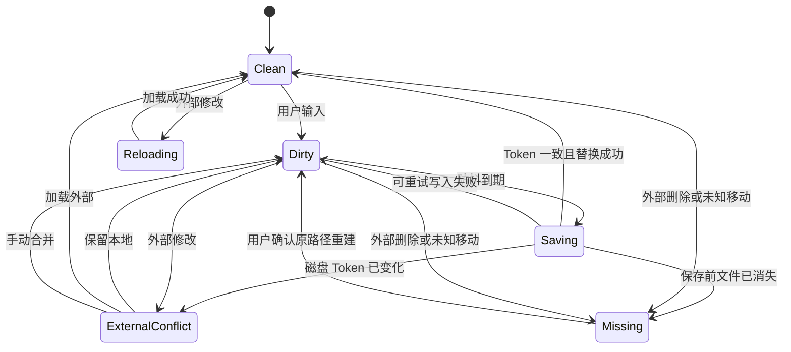
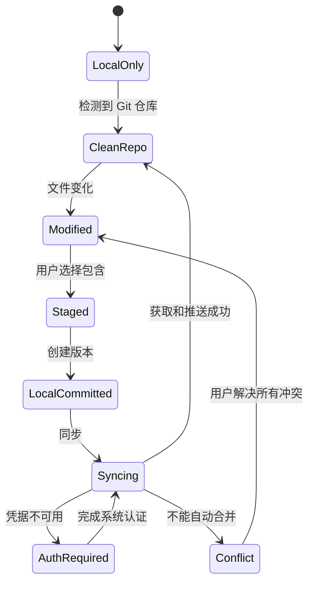

# Easy Markdown MVP 技术选型与架构

| 字段 | 内容 |
| --- | --- |
| 文档状态 | 暂定选型，等待 Spike 验证 |
| 版本 | 0.1 |
| 日期 | 2026-07-18 |

## 1. 最终推荐栈

| 层次 | 选择 | 用途 |
| --- | --- | --- |
| 桌面框架 | Tauri 2.x | 窗口、IPC、安装和系统集成 |
| 系统核心 | Rust stable MSVC | 文件、路径、Git、搜索、监听、安全边界 |
| 前端 | React 当前稳定版 + TypeScript Strict | 桌面 UI |
| 构建 | Vite 当前稳定版 | 前端开发和构建 |
| 包管理 | pnpm + Lockfile | JS 依赖复现 |
| 样式 | Tailwind CSS | 零运行时样式和设计 Token |
| 可访问组件 | Radix Primitives | Dialog、Menu、Tooltip 等交互原语 |
| 长列表 | TanStack Virtual，按需引入 | 大目录和长搜索结果虚拟化 |
| 编辑器 | CodeMirror 6 | Markdown/TXT 编辑 |
| Diff/冲突 | `@codemirror/merge` | 统一和并排差异 |
| Markdown | `react-markdown` + `remark-gfm` | 安全 GFM 预览 |
| 状态管理 | Zustand | 工作区、标签页、同步和 UI 状态 |
| 文件访问 | Rust 专用 Commands | 根目录校验、读写和资源访问 |
| 文件监听 | Rust `notify` 系列实现 | 递归监听、去抖和重扫 |
| Git | 系统 Git CLI | 状态、Diff、版本、远端和凭据 |
| 全文搜索 | 捆绑 ripgrep Sidecar | 无索引实时搜索 |
| 本地设置 | Tauri Store | 最近工作区和界面设置 |
| Rust 测试 | Cargo Test | 文件、路径、Git 集成 |
| 前端测试 | Vitest + Testing Library | 组件和状态 |
| 桌面 E2E | WebdriverIO Tauri Service | Windows 主流程 |
| 日志 | Rust `tracing` + 受控落盘 | 无正文、无凭据诊断 |

版本策略：

- 初始化项目时使用各组件当前稳定版本。
- 锁定 `pnpm-lock.yaml` 和 `Cargo.lock`。
- Tauri、React、Vite、CodeMirror 不使用未发布分支或 nightly。
- Rust 使用稳定 Toolchain，并在 `rust-toolchain.toml` 固定团队版本。

Tailwind 通过 Vite 插件生成静态 CSS，不引入运行时样式引擎；Radix 提供符合常见 WAI-ARIA 模式的无样式交互原语，避免自行实现 Dialog、菜单和焦点管理。[Tailwind Vite 集成](https://tailwindcss.com/docs/installation/using-vite) [Radix Primitives](https://www.radix-ui.com/primitives/docs/overview/introduction)

## 2. 桌面框架评分

评分为当前产品约束下的工程判断，不代表框架通用优劣。

| 维度 | 权重 | Tauri 2 | Electron | 分平台原生 |
| --- | ---: | ---: | ---: | ---: |
| 文件与进程安全边界 | 25% | 5 | 3 | 5 |
| 本地系统能力 | 20% | 5 | 5 | 5 |
| MVP 开发速度 | 20% | 3.5 | 5 | 2 |
| 安装和资源体积 | 15% | 5 | 2 | 5 |
| 跨平台渲染一致性 | 10% | 3.5 | 5 | 2 |
| 生态和自动化测试 | 10% | 4 | 5 | 3 |
| 加权结果 | 100% | **4.45** | **4.00** | **3.85** |

选择 Tauri 2，主要因为：

- 文件和 Git 操作可以集中在 Rust 信任边界。
- WebView 仅调用有限 IPC，不拥有 Node.js。
- 产品不是复杂浏览器或在线协作应用，不需要捆绑完整 Chromium。

## 3. 编辑器评分

| 维度 | CodeMirror 6 | Monaco |
| --- | ---: | ---: |
| Markdown/TXT 聚焦 | 5 | 3 |
| 模块化和体积 | 5 | 2.5 |
| Diff/Merge | 4.5 | 5 |
| 大文档能力 | 4.5 | 5 |
| IDE/LSP 能力 | 3 | 5 |
| 定制编辑体验 | 5 | 4 |

选择 CodeMirror 6：

- MVP 不需要完整 IDE 或 LSP。
- 同一个编辑内核可覆盖编辑、只读 Diff 和冲突解决。
- 事务模型便于区分用户输入、外部刷新和程序化替换。

## 4. Git 实现评分

| 维度 | 系统 Git CLI | libgit2/git2 |
| --- | ---: | ---: |
| 与现有凭据兼容 | 5 | 3 |
| 与 Git 行为一致 | 5 | 4 |
| Hooks/签名/Worktree | 5 | 3.5 |
| 无外部依赖 | 2.5 | 5 |
| 结构化 API | 3.5 | 5 |
| 团队维护成本 | 4.5 | 3 |

选择系统 Git CLI：

- 复用用户已经配置的 SSH 和 Credential Helper。
- 不自行管理 Token。
- 使用 Porcelain/NUL 格式消除大部分输出解析风险。
- 本地编辑在 Git 缺失时仍可使用。

## 5. 搜索实现评分

| 维度 | ripgrep | SQLite FTS5 |
| --- | ---: | ---: |
| 零索引和实时一致性 | 5 | 2 |
| 实现复杂度 | 5 | 2.5 |
| 关键词搜索性能 | 4.5 | 5 |
| 相关度排序 | 2 | 5 |
| 元数据组合查询 | 2 | 5 |
| 删除后重建成本 | 5 | 3 |

MVP 选择 ripgrep，等真实规模和需求证明有必要后再增加 FTS5。

## 6. 逻辑架构



## 7. 进程和信任边界

### 7.1 WebView

可以做：

- 展示目录、编辑器和预览。
- 管理界面状态。
- 调用明确的 Rust Commands。

不能做：

- 直接执行任意系统命令。
- 获得任意绝对路径读写能力。
- 直接访问 `.git`。
- 加载远程脚本。
- 执行 Markdown 内嵌 HTML。

### 7.2 Rust Core

负责：

- 保存工作区根目录。
- 相对路径解析和越界校验。
- 文件读取、保存、移动和回收站操作。
- 文件 Watch。
- Git 和 ripgrep 子进程。
- 资源协议。
- 日志脱敏、超时和取消。

### 7.3 外部 Agent

外部 Agent 不经过应用 IPC，因此：

- 由 Agent 宿主或操作系统授予文件权限。
- 推荐只授权独立 Worktree。
- 应用只能检测结果和提供 Diff，不能阻止宿主已经允许的写入。

## 8. 建议代码结构

```text
easy_markdown/
├── src/
│   ├── app/
│   ├── components/
│   ├── features/
│   │   ├── workspace/
│   │   ├── explorer/
│   │   ├── editor/
│   │   ├── preview/
│   │   ├── search/
│   │   └── source-control/
│   ├── stores/
│   └── contracts/
├── src-tauri/
│   ├── capabilities/
│   └── src/
│       ├── commands/
│       ├── workspace/
│       ├── files/
│       ├── watcher/
│       ├── git/
│       ├── search/
│       ├── assets/
│       └── security/
├── tests/
│   ├── fixtures/
│   └── e2e/
└── docs/
```

约束：

- `contracts` 只保存 IPC 请求/响应的 TypeScript 类型。
- 前端不复制文件系统和 Git 业务规则。
- Rust 模块不依赖 UI 文案。
- Git 命令只能从允许列表构造，不能接受前端传入任意参数数组。

## 9. IPC 设计

示例，不是最终 API：

```text
workspace.open(path) -> WorkspaceInfo
workspace.close(id) -> void
files.list(id, relativePath) -> Entry[]
files.readText(id, relativePath) -> TextDocument
files.saveText(id, relativePath, content, expectedVersion) -> SaveResult
files.move(id, source, target) -> Entry
files.trash(id, relativePath) -> void
search.query(id, query, options) -> streamed SearchEvent
git.status(id) -> RepositoryStatus
git.stage(id, paths) -> RepositoryStatus
git.unstage(id, paths) -> RepositoryStatus
git.diff(id, scope, path?) -> DiffDocument
git.commit(id, message) -> CommitResult
git.fetch(id) -> SyncResult
git.push(id) -> SyncResult
git.createAgentWorktree(id, taskId) -> WorktreeInfo
```

IPC 规则：

- 错误返回稳定错误码和可本地化信息。
- 不把 Git 原始 stderr 直接作为唯一用户提示。
- 长任务带 operation ID，支持进度和取消。
- 文件正文只在显式打开时返回，日志不记录正文。

## 10. 文件保存状态机



## 11. Git 状态机



## 12. Markdown 安全策略

| 输入 | MVP 行为 |
| --- | --- |
| Markdown 原始 HTML | 显示为文本或忽略，不解析执行 |
| 相对 `.md/.txt` 链接 | 应用内导航 |
| 相对本地图片 | 通过受控资源协议加载 |
| HTTP/HTTPS 链接 | 系统浏览器打开 |
| HTTP/HTTPS 图片 | 默认不自动加载 |
| `javascript:` | 拒绝 |
| `file:` | 拒绝 |
| `data:` | 默认拒绝 |
| SVG | Spike 验证脚本、外链和资源引用后决定 |
| Mermaid | P0 不支持 |

Tauri CSP：

- `default-src 'self'`
- `script-src 'self'`
- `style-src 'self'`；CodeMirror 运行时样式通过 Vite `cspNonce` 载体和 Tauri
  打包响应生成的随机 style nonce 放行，不使用生产环境 `unsafe-inline`
- 禁止远程脚本和 `eval`
- `img-src` 只包含应用资源和受控本地协议
- `connect-src` 默认不开放，Git 网络由后端进程完成；开发 CSP 仅额外允许本地 Vite
  HMR，并使用固定开发 nonce

## 13. MVP Git 策略

### 13.1 本地版本

- 使用普通 Git Index。
- 用户选择文件等同于 Stage。
- 创建版本等同于 Commit。
- 不自动 Commit。

### 13.2 团队同步

- 主分支优先 fast-forward。
- 有本地提交且远端前进时，不自动 Rebase。
- 引导用户推送独立变更分支并在远端评审。
- 应用内不实现 Pull Request API。

### 13.3 Agent

- Agent 任务优先使用独立 Worktree。
- 分支名 `agent/<task-id>`。
- Worktree 存放在应用数据目录或用户明确选择的任务目录。
- 任务结束前不删除 Worktree。
- 删除前检查未提交和未推送变化。

## 14. 测试金字塔

| 层 | 内容 | 工具 |
| --- | --- | --- |
| Rust 单元 | 路径、安全、编码、解析 | Cargo Test |
| Rust 集成 | 临时文件、Git 仓库、ripgrep | Cargo Test |
| 前端单元 | Store、Markdown URL 规则、状态机 | Vitest |
| 组件 | 编辑器壳、目录树、冲突界面 | Testing Library |
| 桌面 E2E | 打开—编辑—保存—版本—恢复 | WebdriverIO Tauri |
| 手工平台 | 中文 IME、系统对话框、凭据、安装 | Windows 测试机 |

发布阻断测试：

- 路径越界。
- 保存中断。
- 外部修改。
- Git 冲突。
- 恶意 Markdown。
- Agent 批量修改恢复。

## 15. 不选择的技术

### 不选择 Electron 作为首选

保留为明确回退方案，但当前安全边界和体积优先级使 Tauri 更合适。

### 不选择 Monaco

MVP 不需要完整 IDE 能力，CodeMirror 已覆盖编辑和 Merge。

### 不选择 libgit2

系统 Git 的凭据、Hooks、Worktree 和行为兼容性更重要。

### 不选择 SQLite 作为正文或搜索真源

会引入索引同步问题。未来仅在性能和结构化检索明确需要时作为可重建缓存。

### 不选择 WYSIWYG Markdown

双向 AST 序列化容易改写用户源文件，破坏稳定 Diff。MVP 使用源码编辑加预览。

### 不选择 MCP 作为 MVP 必需接口

文件系统已经满足 Agent 读取和修改。MCP 可作为未来的受控搜索、版本和评审工具层。

## 16. 选型生效条件

当前选型标记为“Accepted for Spike”。

完成 [五天技术 Spike](03-spike-plan.md) 且全部硬门槛通过后：

- Tauri 2、Rust Core、CodeMirror、系统 Git CLI 和 ripgrep 升级为正式选型。
- 更新 ADR 状态为 Accepted。
- 开始 Sprint 1 实现。
